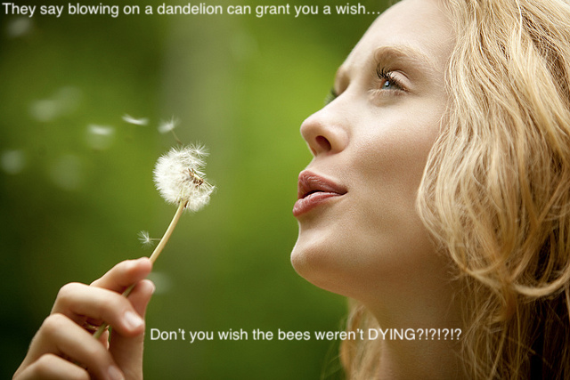

First we load in the databases
```{r}
load("COMADRE_v.2.0.1.RData")
load("COMPADRE_v.4.0.1.RData")
```


#Part A

Brendan and I are working on a project modelling contagion in populations of honey bee and bumble bee species where the contagion is transmitted through several flowers. 

Initially we tried to use this as an oppurtunity to investigate the population models of the bees, however there are no models of bee populations in the database, or even any Hymenoptera populations at all

```{r}
grep(comadre$metadata$Order,pattern = 'Hymenoptera')
```


Thus, instead of working with the bee populations we decided to look at one of the species of flower that is a transmission vector between bumblebees and honeybees: The white clover, i.e. *Trifolium repens* 

First we check that it exists in the database:
```{r}
grep(compadre$metadata$SpeciesAccepted,pattern = 'Lotus corniculatus')
```

From the above chunk we see that indeed it exists in the database, now we would like to choose the model which is the most relevant to our research, which is mainly concerned with these populations in Vermont and the greater New England area. To see which dataset is most appropriate for our purposes we will look at some of the info for each dataset.

```{r}
allDatasets = grep(compadre$metadata$SpeciesAccepted,pattern = 'Lotus corniculatus')

for (dataset in allDatasets){
  print(paste0("Dataset #: ", dataset))
  print(paste0("Continent: ", compadre$metadata$Continent[dataset]))
  print(paste0("Country: ", compadre$metadata$Country[dataset]))
  print(paste0("Ecoregion: ", compadre$metadata$Ecoregion[dataset]))
  print(paste0("Latitude: ", compadre$metadata$Lat[dataset]))
  print(paste0("Longitude: ", compadre$metadata$Lon[dataset]))
  print("______________________________________________")
  
}

```

Whelp, that didnt narrow down our search at all. I guess we will check out the papers to see the locations of the species.

```{r}
for (dataset in allDatasets){
  print(paste0("Dataset #: ", dataset))
  print(paste0("DOI: ", compadre$metadata$DOI.ISBN[dataset]))
  print("______________________________________________")
  
}

```

Ok so from this output we can see that apparently all these datasets came from from research involved in one particular publication. 

Upon reading the publication we find that the methods are quite complex, and only some of the matrices used can be used for our purposes. To identify if any of the available ones are such matrices we gather some further info about them.


```{r}
allDatasets = grep(compadre$metadata$SpeciesAccepted,pattern = 'Lotus corniculatus')

for (dataset in allDatasets){
  print(paste0("Dataset #: ", dataset))
  print(paste0("Continent: ", compadre$metadata$Continent[dataset]))
  print(paste0("Country: ", compadre$metadata$Country[dataset]))
  print(paste0("Matrix Composite: ", compadre$metadata$MatrixComposite[dataset]))
  print(paste0("Matrix Treatment: ", compadre$metadata$MatrixTreatment[dataset]))
  print(paste0("Matrix Start Year: ", compadre$metadata$MatrixStartYear[dataset]))
  print(paste0("Matrix End Year: ", compadre$metadata$MatrixEndYear[dataset]))
  print(paste0("Matrix Start Season: ", compadre$metadata$MatrixStartSeason[dataset]))
  print(paste0("Matrix End Season: ", compadre$metadata$MatrixEndSeason[dataset]))
  print(paste0("Matrix Start Month: ", compadre$metadata$MatrixStartMonth[dataset]))
  print(paste0("Matrix End Month: ", compadre$metadata$MatrixEndMonth[dataset]))
  print(paste0("Matrix Split: ", compadre$metadata$MatrixSplit[dataset]))
  print(paste0("Matrix Criteria Ontogeny: ", compadre$metadata$MatrixCriteriaOntogeny[dataset]))
  print(paste0("Matrix Criteria Age: ", compadre$metadata$MatrixCriteriaAge[dataset]))
  print(paste0("Matrix Criteria Size: ", compadre$metadata$MatrixCriteriaSize[dataset]))
  print(paste0("Matrix Observation: ", compadre$metadata$MatrixPopulation[dataset]))
  
  print(paste0("Matrix Class described by author: ", compadre$matrixClass$MatrixClassAuthor[dataset]))
  print(paste0("Matrix Class standardized by compadre creators: ", compadre$matrixClass$MatrixClassOrganized[dataset]))
  print(paste0("Matrix Class numerical representation: ", compadre$matrixClass$MatrixClassNumber[dataset]))

  print("______________________________________________")
  
}

```

Narrowing down the criteria to ones that there is documentation for


```{r}
allDatasets = grep(compadre$metadata$SpeciesAccepted,pattern = 'Lotus corniculatus')

for (dataset in allDatasets){
  print(paste0("Dataset #: ", dataset))
  print(paste0("Continent: ", compadre$metadata$Continent[dataset]))
  print(paste0("Country: ", compadre$metadata$Country[dataset]))
  print(paste0("Matrix Composite: ", compadre$metadata$MatrixComposite[dataset]))
  print(paste0("Matrix Treatment: ", compadre$metadata$MatrixTreatment[dataset]))
  print(paste0("Matrix Split: ", compadre$metadata$MatrixSplit[dataset]))
  print(paste0("Matrix Criteria Ontogeny: ", compadre$metadata$MatrixCriteriaOntogeny[dataset]))
  print(paste0("Matrix Criteria Age: ", compadre$metadata$MatrixCriteriaAge[dataset]))
  print(paste0("Matrix Criteria Size: ", compadre$metadata$MatrixCriteriaSize[dataset]))
  print("______________________________________________")
  
}

```

Whelp, we tried everything we could to figure out whether we could use one of the matrices for white clover but the documentation for these is incredibly poor. In the journal article the only population matrix that matches the kind we covered in class would be what the authors call the "composite matrix", as all the other matrices only cover a small part of the lifecycle. And because of the poor documentation, it is impossible to tell which available dataset contains that matrix, if any. 

So instead we will try to do a similar process with another flower that both bumblebees and honeybees pollinate, the common dandelion, which according to Wikipedia, is named *Taraxacum officinale*, but also according to Wikipedia is synonymous with *Taraxacum campylodes*, which we found using the code below.

```{r}
dandelions = grep(compadre$metadata$SpeciesAccepted, pattern = 'Taraxacum')
for (dandelion in dandelions){
  print(compadre$metadata$SpeciesAccepted[dandelion])
}
```

Now to differentiate between the datasets for Taraxacum campylodes we loop through them printing out the location and journal article which they come from

```{r}
campylodeses = grep(compadre$metadata$SpeciesAccepted,pattern = 'Taraxacum campylodes')

for (campylodes in campylodeses){
  print(paste0("Dataset #: ", campylodes))
  print(paste0("DOI: ", compadre$metadata$DOI.ISBN[campylodes]))
  print(paste0("Country: ", compadre$metadata$Country[campylodes]))
  print(paste0("Latitude: ", compadre$metadata$Lat[campylodes]))
  print(paste0("Longitude: ", compadre$metadata$Lon[campylodes]))
  print("______________________________________________")
  
}

```

Well it turns out that 3/4 come from the same article where the data is collected in West Virginia(based on latitude and longitude) and the last comes from Illinois. 

Reading the articles we find that the data in the 5th listed dataset is appropriate for our purposes for multiple reasons. With the ultimate goal in mind of using modelling approaches to inform management strategies to prevent the spread of disease between honey bees and bumblebees, these reasons include:

* Both bumble bees and honey bees pollinate the common dandelion, so it is a potential vector

* The common dandelion is one of the most recognizable flowers to the average person, thus if it were suggested by seperate, associated research, that increased or decreased density of dandelions decreased the spread of diseases between bees, then public awareness campaigns to either encourage the weeding or the spreading of dandelions would be potentially useful management strategies

* The dandelion itself is an invasive species, so before any such campaigns as mentioned above were to be launched, a thorough understanding of how these populations grow would be necessary to avoid unwanted consequences


#Part B

Recent research suggests that flowers pollinated by both honey bees and bumble bees can act as a disease vector between the two species. Additionally, out of several tested species of flowers, research has found that different flowers have different capacities as disease vectors. With the goal of managing the spread of these disease in mind, we would like to be able to consider increasing or decreasing the density of differnt species of flower as a potential management strategy. Multiple considerations are involved in this intervention approach. While dandelions have yet to be tested for their efficacy as a disease vector, since it has been demonstrated that other species of flower have differential efficacies, we can assume that the dandelion is either less or greater than average in its spreading efficacy. The questions that we would want to answer with this matrix model depends upon the answer to that question.

#####If Dandelions are found to be __unlikely__ to harbor the pathogen:
* Can we safely increase the dandelion poulation to decrease the pathogen without creating a runaway invasive species?

* One potential management strategy would be to launch a public awareness campaign to encourage people to spread and not kill dandelions in order to \#SaveTheBees. An easy and potentially eye-catching and memorable advertising tactic might involve the image of a person blowing a dandelion [example pictured]. However this tactic would only effective if that stage in the lifecycle were important. So we would like to find out if that is true.


<p style="text-align:left;"></p>


#####If Dandelions are found to be __likely__ to harbor the pathogen:
* How low do we need to make the population density before it will collapse?

* Is there a particular stage of development that we should target to me most effective in eradicating the plant?

